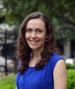
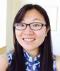
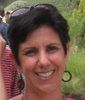
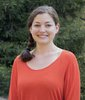
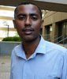
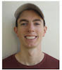

|                                             |                       |
|---------------------------------------------|-----------------------|
|{align=left} | **Dr. Stephen Vosti**   Adjunct Professor, Department of Agricultural and Resource Economics, UC Davis     Co-PI, Economics, MINIMOD Project   [:material-email:](mailto:vosti@primal.ucdavis.edu) [:material-web:](http://are.ucdavis.edu/people/faculty/stephen-vosti/) [:material-book:](https://scholar.google.com/citations?user=5tviTWQAAAAJ&hl=en)|
| {align=left} | **Dr. Reina Engle-Stone**   Assistant Professor, Department of Nutrition, UC Davis   Co-PI, Nutrition, MINIMOD Project   [:material-email:](mailto:renglestone@ucdavis.edu) [:material-web:](http://nutrition.ucdavis.edu/people/faculty/englestone_reina.html) [:material-book:](https://scholar.google.com/citations?user=3IdJLu8AAAAJ&amp;hl=en) |
| | **Dr. Hanqi Luo**   Senior Biostatistician, BRINDA team, Emory University   Department of Global Health, Rollins School of Public Health   [:material-email:](mailto:luohanqi@gmail.com) [:material-book:](https://scholar.google.com/citations?user=cVBKMiwAAAAJ&amp;hl=en) | 
|  | **Ann Tarini**   Public Health Nutrition Consultant    Policy engagment in Cameroon, MINIMOD Project   [:material-email:](mailto:tariniann@gmail.com) |
|  | **Dr. Katherine Adams**   Assistant Project Scientist, Department of Nutrition, UC Davis   Cost analysis and simplified tool development, MINIMOD Project   [:material-email:](mailto:kpittenger@ucdavis.edu) [:material-book:](https://scholar.google.com/citations?user=_j3Yh-YAAAAJ&hl=en) | 
 | **Caitlin French**   Graduate Student Researcher, Department of Nutrition, UC Davis   Nutrition benefits estimation, MINIMOD Project   [:material-email:](mailto:cdfrench@ucdavis.edu) | 
| | **Demewoz Haile Woldegebreal**   Graduate Student Researcher, Department of Nutrition, UC Davis    Nutrition benefits estimation, MINIMOD Project   [:material-email:](mailto:dewolde@ucdavis.edu) | 
| | **Ken Brown**   Distinguished Professor Emeritus, Department of Nutrition, UC Davis    Nutrition policy engagement, MINIMOD Project   [:material-email:](mailto:Ken.Brown@gatesfoundation.org)
| | **Michael Jarvis**   Research Consultant, UC Davis   MINIMOD Project   [:material-email:](mailto:mjarvis@ucdavis.edu) [:material-web:](www.linkedin.com/in/jarvis-michael) |