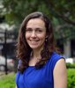
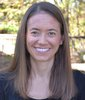
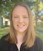
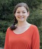
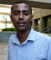
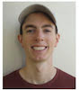
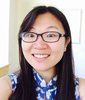
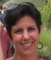

## Project Manager
|                                             |                       |
|---------------------------------------------|-----------------------|
| {: alt="Portrait photo of Dr. Stephen Vosti"} | **Dr. Stephen Vosti**   Adjunct Professor Emeritus, Department of Agricultural and Resource Economics, UC Davis     Co-PI, Economics, MINIMOD Project, Institute for Global Nutrition, UC Davis   [:material-email:](mailto:savosti@ucdavis.edu){: aria-label="Email Dr. Stephen Vosti"} [:material-web:](https://are.ucdavis.edu/people/emeriti/stephen-vosti/){: aria-label="Visit Dr. Stephen Vosti's website"} [:material-book:](https://scholar.google.com/citations?user=5tviTWQAAAAJ&hl=en){: aria-label="Visit Dr. Stephen Vosti's Google Scholar page"} |
| {: alt="Portrait photo of Dr. Reina Engle-Stone"} | **Dr. Reina Engle-Stone**   Assistant Professor, Department of Nutrition, UC Davis   Co-PI, Nutrition, MINIMOD Project, Institute for Global Nutrition, UC Davis   [:material-email:](mailto:renglestone@ucdavis.edu){: aria-label="Email Dr. Reina Engle-Stone"} [:material-web:](http://nutrition.ucdavis.edu/people/faculty/englestone_reina.html){: aria-label="Visit Dr. Reina Engle-Stones's website"} [:material-book:](https://scholar.google.com/citations?user=3IdJLu8AAAAJ&amp;hl=en){: aria-label="Visit Dr. Reina Engle-Stone's Google Scholar page"} |

## Collaborating Scientists
|                                             |                       |
|---------------------------------------------|-----------------------|
| {: alt="Portrait photo of Dr. Katherine Adams"} | **Dr. Katherine Adams**   Associate Project Scientist, Department of Nutrition, UC Davis   Cost analysis and simplified tool development, MINIMOD Project, Institute for Global Nutrition, UC Davis   [:material-email:](mailto:kpittenger@ucdavis.edu){: aria-label="Email Dr. Katherine Adams"} [:material-book:](https://scholar.google.com/citations?user=_j3Yh-YAAAAJ&hl=en){: aria-label="Visit Dr. Katherine Adams' Google Scholar page"} |
| {: alt="Portrait photo of Emily Becher"} | **Emily Becher**   PhD Student, Department of Nutrition, UC Davis   Institute for Global Nutrition, UC Davis   [:material-web:](https://www.linkedin.com/in/emily-becher-a50542115){: aria-label="Visit Emily Becher's website"} |
| {: alt="Portrait photo of Ken Brown"} | **Ken Brown**   Distinguished Professor Emeritus, Department of Nutrition, UC Davis    Nutrition policy engagement, MINIMOD Project, Institute for Global Nutrition, UC Davis   [:material-email:](mailto:Ken.Brown@gatesfoundation.org){: aria-label="Email Ken Brown"}
| {: alt="Portrait photo of Armando Rangel Colina"} | **Armando Rangel Colina**   PhD Student, Agricultural and Resource Economics, UC Davis   [:material-email:](mailto:arangel@ucdavis.edu){: aria-label="Email Armando Rangel Colina"} [:material-web:](https://www.linkedin.com/in/armando-rangel-colina-0a3595125){: aria-label="Visit Armando Rangel Colina's website"} |
{: alt="Portrait photo of Caitlin French"} | **Caitlin French**   Graduate Student Researcher, Department of Nutrition, UC Davis   Nutrition benefits estimation, MINIMOD Project, Institute for Global Nutrition, UC Davis   [:material-email:](mailto:cdfrench@ucdavis.edu){: aria-label="Email Caitlin French"} |
| {: alt="Portrait photo of Demewoz Haile Woldegebreal"} | **Demewoz Haile Woldegebreal**   Research Fellow, Institute for Health Metrics and Evaluation, University of Washington, Seattle    Nutrition benefits estimation, MINIMOD Project, Institute for Global Nutrition, UC Davis   [:material-email:](mailto:dewolde@ucdavis.edu){: aria-label="Email Demewoz Haile Woldegebreal"} |
| {: alt="Portrait photo of Michael Jarvis"} | **Michael Jarvis**   Research Consultant, UC Davis   MINIMOD Project   [:material-email:](mailto:mjarvis@ucdavis.edu){: aria-label="Email Michael Jarvis"} [:material-web:](https://www.linkedin.com/in/jarvis-michael/){: aria-label="Visit Michael Jarvis' website"} |
| {: alt="Portrait photo of Dr. Hanqi Luo"} | **Dr. Hanqi Luo**   Senior Biostatistician, BRINDA team, Emory University   Department of Global Health, Rollins School of Public Health   [:material-email:](mailto:luohanqi@gmail.com){: aria-label="Email Dr. Hanqi Luo"} [:material-book:](https://scholar.google.com/citations?user=cVBKMiwAAAAJ&amp;hl=en){: aria-label="Visit Dr. Hanqi Luo's Google Scholar page"} |
| {: alt="Portrait photo of Aleksandr Michuda"} | **Aleksandr Michuda**   Center for Data Science for Enterprise and Society, Cornell University   [:material-email:](mailto:amichuda@ucdavis.edu){: aria-label="Email Aleksandr Michuda"}[:material-web:](https://amichuda.github.io/){: aria-label="Visit Alexsandr Michuda's website"} |
| {: alt="Portrait photo of Ann Tarini"} | **Ann Tarini**   Public Health Nutrition Consultant    Policy engagement specialist, MINIMOD Project   [:material-email:](mailto:tariniann@gmail.com){: aria-label="Email Ann Tarini"} |
| {: alt="Portrait photo of Lauren Thompson"} | **Lauren Thompson**   PhD Student, Department of Nutrition, UC Davis   Institute for Global Nutrition, UC Davis   [:material-web:](https://www.linkedin.com/in/lauren-thompson330){: aria-label="Visit Lauren Thomspon's website"} |
