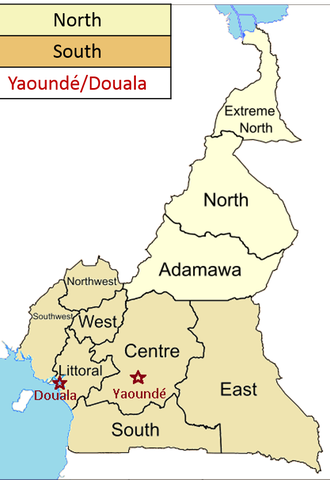
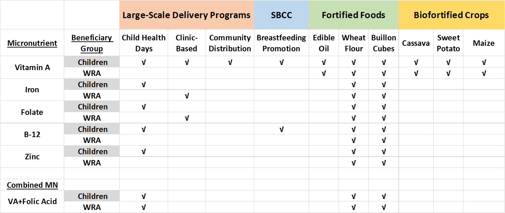

---
hide:
    - toc
---

{: align=right}

Cameroon has three geopolitical macro-regions: the Northern macro-region (comprising the Far North, North, and Adamawa provinces), the South macro-region (comprising the remaining provinces), and the Cities macro-region, which is comprised of the country’s two major metropolitan areas (Douala and Yaoundé). Each of the macro-regions have distinct agro-climactic conditions, dietary intake patterns, prevalences of vitamin and mineral deficiencies among target beneficiary groups, and micronutrient delivery program costs. Targeting micronutrient intervention programs based on spatial variations in need, benefits, and costs can generate efficiency gains, i.e., achieving greater success in addressing micronutrient deficiencies for the same level of funding, or, reducing the costs of achieving the success generated by current sets of micronutrient intervention programs.

## Micronutrient Policy Issues

For MINIMOD modeling activities in Cameroon, key micronutrient policy issues for each of macro-regions are:

- **For children aged 6-59 months**
    - Identification of cost-effective strategies for ensuring adequate dietary intake of vitamin A
    - Identification of cost-effective strategies for ensuring adequate dietary intake of zinc
    - Identification of cost-effective strategies for ensuring adequate dietary intake of iron
    - Identification of cost-effective strategies for ensuring adequate dietary intake of vitamin B12
    - Assessment of the potential for micronutrient intervention programs to reduce child mortality
    - Assessment of the potential for micronutrient intervention programs to reduce child stunting
- **For women of reproductive age (15-49 years)**
    - Identification of cost-effective strategies for addressing deficiencies in dietary intake of iron
    - Identification of cost-effective strategies for addressing deficiencies in dietary intake of folate
    - Assessment of the potential for micronutrient intervention programs to reduce maternal anemia

<figure>
    
    <figcaption>The scope of MINIMOD modeling activities in Cameroon to date. SBCC, social and behavior change communication; WRA, women of reproductive age (15-49).</figcaption>
</figure>
