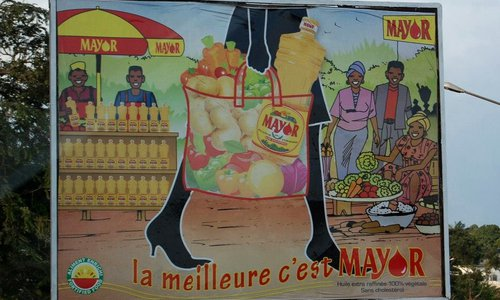

# Cameroon Micronutrient Intervention Programs - Micronutrient Intervention Modeling Project

## Background

{align=left}

Micronutrient deficiencies can be addressed via a broad range of different intervention strategies, including intermittent or continuous preventive or therapeutic micronutrient supplementation, large-scale or targeted food fortification, social and behavior change communication to encourage greater consumption of micronutrient-rich foods and to promote optimal breast-feeding practices, agricultural interventions (including biofortification) to increase the year-round availability of and access to micronutrient-rich foods, food processing to enhance micronutrient uptake, and health interventions such as deworming and diarrhea control to improve micronutrient absorption and utilization.

## Micronutrient Intervention Programs - Existing and Experimental

The MINIMOD team has modeled the following existing and experimental micronutrient intervention programs for Cameroon (with links to more information from the World Health Organization).

- [Periodic high-dose supplementation](http://www.who.int/elena/titles/guidance_summaries/vitamina_children/en/) (vitamin A)
- [Deworming tablets](http://www.who.int/elena/titles/deworming/en/)
- [Dietary supplementation](http://www.who.int/elena/titles/zinc_stunting/en/) (zinc)
- [Large-scale food fortification](http://www.who.int/nutrition/publications/guide_food_fortification_micronutrients.pdf) (vitamin A, zinc, folate, iron, vitamin B12)
    - [wheat flour](http://www.who.int/elena/titles/wheat-flour-fortification/en/)
    - [oil](http://www.who.int/elena/titles/vitamina_fortification/en/)
    - [bullion cubes](http://www.who.int/nutrition/events/2014_fortification-condiments_26to28Aug/en/)
- [Biofortification](http://www.who.int/elena/titles/biofortification/en/) (vitamin A, zinc, iron)
- Micronutrient powder (vitamin A, zinc, folate, iron, vitamin B12)
    - [children 6-23 mo](http://www.who.int/elena/titles/micronutrientpowder_infants/en/)
    - [children 2-12 yrs](http://www.who.int/elena/titles/micronutrientpowder-children/en/)
    - [pregnant women](http://www.who.int/elena/titles/micronutrientpowder_pregnancy/en/)
- Social and behavior change communication for promotion of increased production and/or consumption of nutrient-rich foods and encouragement of breast-feeding practices that are consistent with [World Health Organization guidelines](http://www.who.int/topics/breastfeeding/en/)

The information given below was taken from the [Global Fortification Data Exchange Website](https://fortificationdata.org/). 

- Oil
    - There have been mandatory fortification programs in place since 2011. Fortification is required for all types of oil.
    - The oil is fortified with Vitamin A.
    - There is imported food monitoring and external monitoring of domestic production.

- Wheat Flour
    - There have been mandatory fortification programs in place since 2011. 
    - Domestic and imported wheat flour is fortified and used in households and in processed food.
    - Wheat flour is fortified with Vitamin B12, Folate, Iron, and Zinc.
    - There is external monitoring of domestic production.
    - There is 100% compliance with the fortificaiton program and there is 92% population coverage.

- Salt
    - There have been mandatory fortification programs in place in 1991. 
    - Domestically produced and imported salt is fortified and used in households and processed food.
    - Salt is fortified with Iodine.
    - There is 86% population covereage.

## Micronutrient Delivery Platforms

The MINIMOD team has modeled the distribution of selected micronutrient intervention programs via the following delivery platforms:

- Child health days
- Clinic-based distribution
- Community-based distribution
  
More information on these delivery platforms can be found [here](http://journals.sagepub.com/doi/abs/10.1177/0379572115598445)