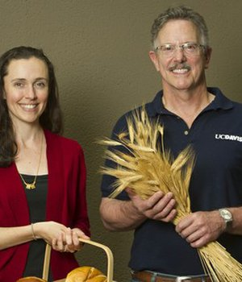
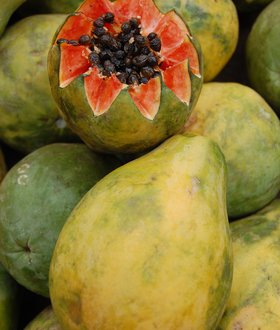
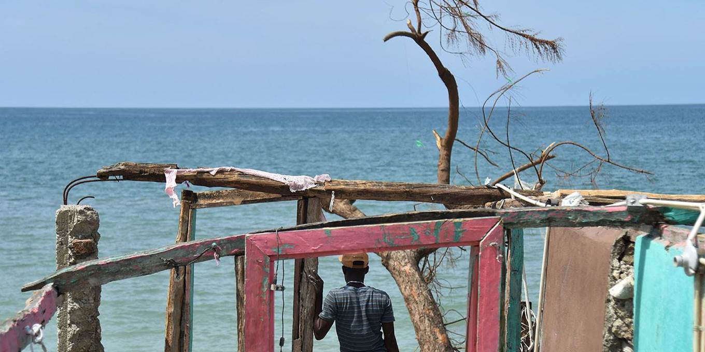

---
hide:
  - navigation
---

<!-- Carousel wrapper -->

  <!-- Indicators -->
  <ol class="carousel-indicators">
    <li data-mdb-target="#carouselBasicExample" data-mdb-slide-to="0" class="active"></li>
    <li data-mdb-target="#carouselBasicExample" data-mdb-slide-to="1"></li>
    <li data-mdb-target="#carouselBasicExample" data-mdb-slide-to="2"></li>
    <li data-mdb-target="#carouselBasicExample" data-mdb-slide-to="3"></li>
    <li data-mdb-target="#carouselBasicExample" data-mdb-slide-to="4"></li>

  </ol>

  <!-- Inner -->
  

    <!-- Single item -->
    

    <figure>
    
      <figcaption>West African Cuisine at the Heart of New Fortification Clinical Trial Led by UC Davis</figcaption>
    </figure>
    

    

    <figure>
    
      <figcaption>Fortifying Wheat Flour in Haiti</figcaption>
      </figure>
    

    <!-- Single item -->
    

    <figure>
    
      <figcaption>Nutrition Proposal Has ‘Transformative Potential’ for Haiti</figcaption>
      </figure>
    

    

      <figure>
      
      <figcaption>Haiti Adopts Food Fortification, Following UC Davis Advice</figcaption>
      </figure>
    

    

      <figure>
      
      <figcaption>Changing the Narrative About Haiti</figcaption>
      </figure>
    

  

  <!-- Inner -->

  <!-- Controls -->
  <a
    class="carousel-control-prev"
    href="#carouselBasicExample"
    role="button"
    data-mdb-slide="prev"
  >
    
    Previous
  </a>
  <a
    class="carousel-control-next"
    href="#carouselBasicExample"
    role="button"
    data-mdb-slide="next"
  >
    
    Next
  </a>

<!-- Carousel wrapper -->

## Project Goal

To develop and use a tool to more efficiently plan and manage national and sub-national micronutrient intervention programs. 

## Context

Micronutrient deficiencies are major contributors to morbidity and mortality among children and women globally. Major intervention strategies for addressing micronutrient deficiencies include: 1) micronutrient supplementation; 2) large- scale food fortification; 3) social and behavior change communications to promote dietary changes and/or breastfeeding; and 4) agricultural interventions, including agro- and biofortification, to increase the supplies of foods rich in micronutrients such as vitamin A, zinc, and iron.

However, little guidance is available on how to select the most appropriate intervention strategy, or mix of strategies, to reach the greatest number of individuals at risk of deficiency and at lowest cost in a given context. Likewise, information is lacking on how best to plan and manage sub-national strategies to help meet the micronutrient needs of women and children to the extent possible when program funds, time, or trained personnel are limited.

## Objectives

- Use nationally representative dietary intake and biomarker data to identify the spatial distributions of selected micronutrient deficiencies within the population and the sub-groups at greatest risk
- Develop a model to predict the effects of alternative micronutrient intervention programs, and combinations of them, on adequacy of dietary intake of key micronutrients (the “nutrition benefits model”)
- Develop a model to predict the costs of alternative micronutrient intervention programs, and combinations of them, over a 10-year planning time horizon (the “cost model”)
- Develop an economic optimization model that can identify the most cost-effective strategies for addressing micronutrient deficiencies, subject to funding and other constraints, over a 10-year planning time horizon
- Use the economic optimization model to identify national and sub-national policy strategies for transitioning from current micronutrient intervention programs to more cost-effective sets of programs
- Use these data and tools, and the results of model simulations, to inform policy discussions around micronutrient deficiencies  

## Focus Micronutrients to Date

Vitamin A, Vitamin B12, Folate, Iron, Zinc, and Iodine

## Target Beneficiary Groups

Children aged 6-59 months; women of reproductive age 

## Measures of Program Impacts

Reach, coverage, effective coverage, supplemental intake, lives saved and anemia cases avoided (in collaboration with the LiST model), excessive intake

## Expected Outcomes

Evidence-based suggestions for more effective and cost-effective national and sub-national micronutrient intervention programs over the 10-year planning time horizons

## Country Projects

Cameroon and Ethiopia

## Tools Under Development

Full MINIMOD tool making use of individual dietary intake and other primary data, and "simplified" MINIMOD tool making use of other available (secondary) data

## Project Partners 

Helen Keller International-Cameroon, Ethiopian Public Health Institute, and the Johns Hopkins University Bloomberg School of Public Health.

The MINIMOD Project is supported in part by a grant from the Bill & Melinda Gates Foundation to the University of California, Davis. Additional support has been provided by the Michael and Susan Dell Foundation, and Sight and Life. 