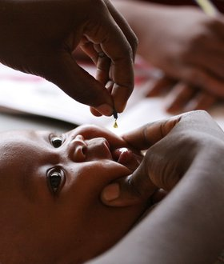
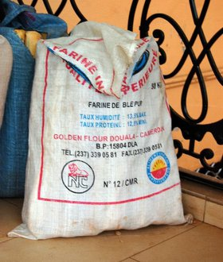
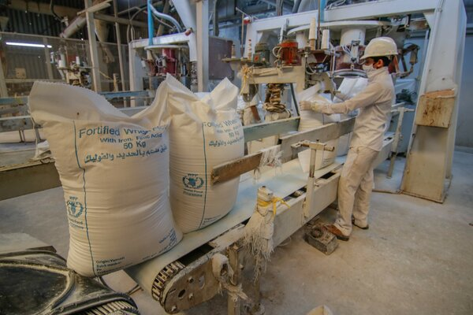
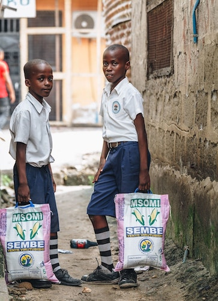
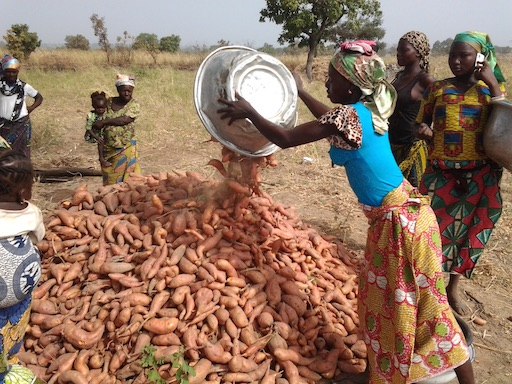
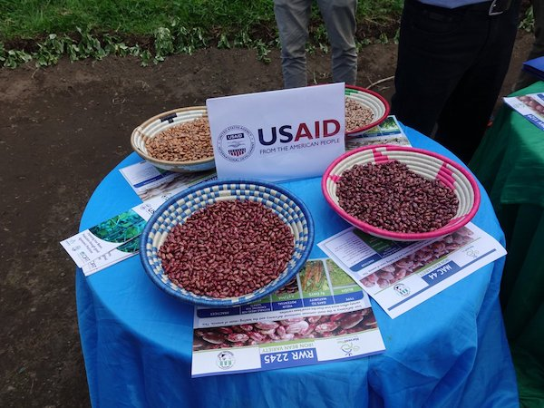
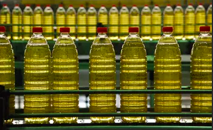
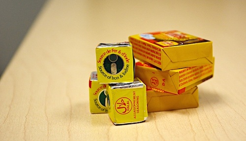

---
hide:
  - navigation
---

<!-- Carousel wrapper -->

  <!-- Indicators -->
  <ol class="carousel-indicators">
    <li data-mdb-target="#carouselBasicExample" data-mdb-slide-to="0" class="active"></li>
    <li data-mdb-target="#carouselBasicExample" data-mdb-slide-to="1"></li>
    <li data-mdb-target="#carouselBasicExample" data-mdb-slide-to="2"></li>
    <li data-mdb-target="#carouselBasicExample" data-mdb-slide-to="3"></li>
    <li data-mdb-target="#carouselBasicExample" data-mdb-slide-to="4"></li>
    <li data-mdb-target="#carouselBasicExample" data-mdb-slide-to="5"></li>
    <li data-mdb-target="#carouselBasicExample" data-mdb-slide-to="6"></li>
    <li data-mdb-target="#carouselBasicExample" data-mdb-slide-to="7"></li>

  </ol>

  <!-- Inner -->
  

    <!-- Single item -->
    

    <figure>
    
      <figcaption>West African Cuisine at the Heart of New Fortification Clinical Trial Led by UC Davis</figcaption>
    </figure>
    

    

    <figure>
    
      <figcaption>Fortifying Wheat Flour in Haiti</figcaption>
      </figure>
    

    

    <figure>
    
      
      </a>
      <figcaption>Freshly milled wheat flour is bagged. World Food Programme, 28 Jul. 2020. Taken by <a href="https://www.wfp.org/stories/wfp-saves-massive-stock-wheat-yemens-frontline">Mahmoud Fadel</a></figcaption>
      </figure>
    

    

    <figure>
    
      
      </a>
      <figcaption>Children walk home with sacks of fortified flour in Tanzania.  Sanku Project Healthy Children, 28 May 2020. Taken by <a href="https://www.nytimes.com/2020/05/28/opinion/coronavirus-africa-malnutrition.html">Malicky Boaz</a></figcaption>
      </figure>
    

    

    <figure>
    
      
      </a>
      <figcaption>Call for the cultivation of Orange-Flesh Sweet Potatoes (OFSP) in Ghana. ZAA Radio, 25 Aug. 2016. Taken by <a href="https://zaaradio.com/health/uds-lecturer-calls-for-presidential-initiative-on-cultivation-orange-flesh-sweet-potato/">Mohammed Ibrahim</a></figcaption>
      </figure>
    

    

    <figure>
    
      
      </a>
      <figcaption>Iron-fortified bean project in Rwanda to combat anemia in children. USUN Rome, 30 May 2018. Taken from <a href="https://twitter.com/USUNRome/status/1001845707379232769">USUN Rome</a></figcaption>
      </figure>
    

    

    <figure>
    
      
      </a>
      <figcaption>Fortified oil with vitamin A. Global Alliance for Improved Nutrition, 1 Sept. 2012. Taken from <a href="https://www.gainhealth.org/taxonomy/term/25">GAIN</a></figcaption>
      </figure>
    

    

    <figure>
    
      
      </a>
      <figcaption>Fortified bouillon cubes with two added micronutrients. UC Davis, 30 Nov. 2020. Taken by <a href="https://research.ucdavis.edu/ghana-clinical-trial/">Reina Engle-Stone</a></figcaption>
      </figure>
    

    
  

  <!-- Inner -->

  <!-- Controls -->
  <a
    class="carousel-control-prev"
    href="#carouselBasicExample"
    role="button"
    data-mdb-slide="prev"
  >
    
    Previous
  </a>
  <a
    class="carousel-control-next"
    href="#carouselBasicExample"
    role="button"
    data-mdb-slide="next"
  >
    
    Next
  </a>

<!-- Carousel wrapper -->

## Project Goal

To develop and use a suite of tools that allows decision-makers to design and manage more cost-effective national and sub-national micronutrient intervention programs. 

## Context

Micronutrient deficiencies are major contributors to morbidity and mortality among children and women globally. Major intervention strategies for addressing micronutrient deficiencies include: 1) micronutrient supplementation; 2) large- scale food and condiment fortification; 3) social and behavior change communications to promote dietary changes and/or breastfeeding; and 4) agricultural interventions, including agro- and biofortification, to increase the supplies of foods rich in micronutrients such as vitamin A, zinc, and iron.

However, little guidance is available to decisionmakers on how to select the most effective and cost-effective national intervention programs, or combinations of programs, to reach the greatest number of individuals at risk of deficiency or inadequate intake, and do so within the budget and human resource constraints that they face. Likewise, information is lacking on how best to plan and manage sub-national strategies to help meet the micronutrient needs of women and children to the extent possible when program funds, time, or trained personnel are limited.

## MINIMOD Project Objectives

- Use nationally representative dietary intake and biomarker data (where available) to identify the spatial patterns of inadequate intake or deficiencies of selected micronutrients within the population, or sub-groups at greatest risk, especially young children or women of reproductive age.
- Develop models to predict the effects of ongoing and alternative (hypothetical) micronutrient intervention programs, and combinations of them, on adequacy of dietary intake of key micronutrients, over a 10-year planning time horizon (the “nutrition benefits models”).
- Develop a model to predict the costs of existing and alternative (hypothetical) micronutrient intervention programs, and combinations of them, over a 10-year planning time horizon (the “cost models”).
- Develop an economic optimization model that can identify the most cost-effective strategies (which may include more than one intervention program) for addressing inadequate micronutrient intake, subject to funding and other constraints, over a 10-year planning time horizon.
- Use the economic optimization model to identify national and sub-national policy strategies for transitioning from current micronutrient intervention programs to more cost-effective sets of programs.
- Use these data and tools, and the results of model simulations, to inform policy discussions around micronutrient deficiencies.

## Focus Micronutrients to Date

Vitamin A, Vitamin B12, Folate, Iron, Zinc, Calcium and Iodine

## Target Beneficiary Groups

Children aged 6-59 months; women of reproductive age 

## Measures of Program Impacts

Reach, coverage, effective coverage, supplemental intake, minimum additional intake, fuctional outcomes such as lives saved and anemia cases avoided (in collaboration with the LiST model), intakes above established micronutrient-specific upper limits (UL).

## Expected Outcomes

Impacts on nutritional and fuctional outcomes of alternative intervention programs; costs of alternative intervention programs; linking nutritional and functional outcomes with intervention program costs to generate estimates of cost-effectiveness; rankings of micronutrient intervention programs based on impacts and on cost-effectiveness; evidence-based suggestions regarding effective and cost-effective national and sub-national micronutrient intervention programs over 10-year planning time horizons; cadres of in-country collaborators trained in the use of MINIMOD tools and in the distillation and delivery of policy messages from model results.

## Country Projects

Burkina Faso, Cameroon, Ethiopia, Nigeria, Senegal

## Suites of Tools Under Development

MINIMOD-Full tool making use of individual dietary intake and other primary data, and the MINIMOD-SD tool making use of available secondary data

**For more information:** Contact Dr. Stephen A. Vosti [(vosti@primal.ucdavis.edu)](mailto:vosti@primal.ucdavis.edu) or Dr. Reina Engle-Stone [(renglestone@ucdavis.edu)](mailto:renglestone@ucdavis.edu), co-Pls of the MINIMOD project.

## Project Partners 

Helen Keller International Country Offices in Burkina Faso, Cameroon, Nigeria, and Senegal; Ethiopian Public Health Institute; and the Johns Hopkins University Bloomberg School of Public Health.

The MINIMOD Project is supported in part by grants from the Bill & Melinda Gates Foundation to the University of California, Davis. Additional support has been provided by the Michael and Susan Dell Foundation, Sight and Life, the Nutrition Program of the New York Academy of Sciences, and by a gift from Mars Incorporated to UC Davis to support training and research in the economics of human nutrition.