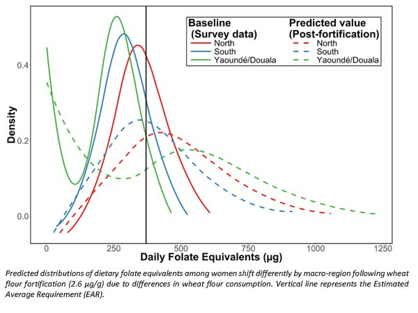

## Benefits Model

### Description

The MINIMOD team has developed a set of modeling methods (the “nutrition benefits models”) to predict the impact of alternative micronutrient intervention programs, and combinations of programs. The methods take into account estimates of nutrient deficiency and inadequate nutrient intake and use information on dietary patterns and program reach to predict the effect of micronutrient programs on dietary adequacy and related outcomes. Through collaboration with the Lives Saved Tool, predicted impacts on lives saved and anemia cases averted are also generated.

### Data

The nutrition benefits models use dietary intake data that were collected using the 24-hour dietary recall method during a national survey of micronutrient status and dietary intake among children 12 to 59 months and women 15 to 49 years in Cameroon in 2009. The 24-hour recall interview process was repeated on a nonconsecutive day in a ~10% subset of households.

### Estimation Methods

Details of the dietary modeling methods are available [here](https://www.ncbi.nlm.nih.gov/pubmed/25332482) and [here](http://journals.sagepub.com/doi/abs/10.1177/0379572115595888).

We use the [National Cancer Institute method](http://riskfactor.cancer.gov/diet/usualintakes) to generate distributions of usual (habitual) nutrient intake.

The modeling process includes reviewing, and in some cases [developing](http://www.fasebj.org/content/30/1_Supplement/891.3.short), methods to estimate the bioavailability of micronutrients.
