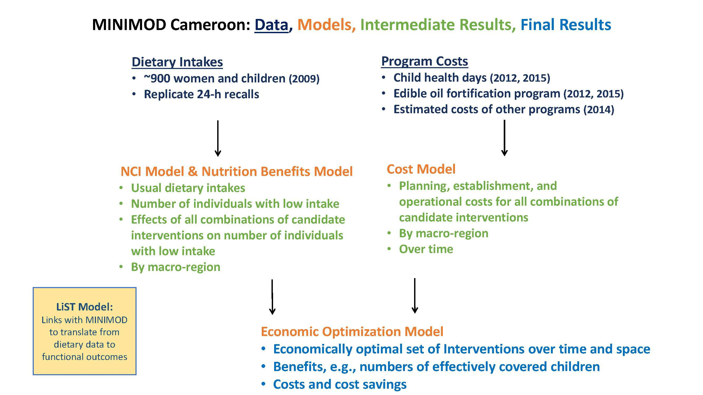

## Optimization Model

As summarized in the figure above, to provide input into the planning and more efficient management of micronutrient intervention programs in Cameroon, the MINIMOD team has developed three sets of models. First, the nutrition benefits models use data on usual dietary intakes to provide spatially-explicit estimates of the number of individuals with low micronutrient intake and the predicted effect of candidate interventions, or combinations of them, on the number of individuals with low intake, or related outcomes. Second, cost models estimate, over time and over space, the total financial cost of delivering these interventions to target beneficiary groups. Finally, an economic optimization model combines the predicted benefits and estimated costs of all possible interventions (and combinations thereof) to determine the most cost-effective set of interventions, over time and over space.

### Description

The economic optimization model establishes a spatially explicit, intertemporal framework that takes as inputs the nutrition benefits of alternative micronutrient interventions and costs associated with planning and undertaking alternative interventions. Using mixed-integer linear programming, this information is combined to find economically efficient micronutrient intervention programs. The model can identify the intervention, or set of interventions, that most cost-effectively meet specific micronutrient objectives, e.g., effectively covering the same number of children as the set of micronutrient intervention programs current in place. The model can also be used to identify the maximum achievable impact (e.g., greatest number of child lives saved) given funding or other constraints.

Theoretically, the usefulness of the economic optimization model inherently depends on variation over space, time, and across target beneficiary groups in expected costs and benefits associated with alternative interventions. Even in a spatially homogenous country, predicting the benefits and costs of alternative program or policy scenarios can generate new insights that are useful for the planning process. Practically, the optimization model’s usefulness depends on the extent to which policy-makers use the information generated by the model process and can develop and implement programs that vary over space, time, and across target beneficiary groups, in ways suggested by the model.
