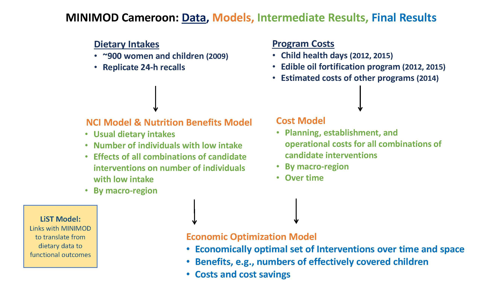
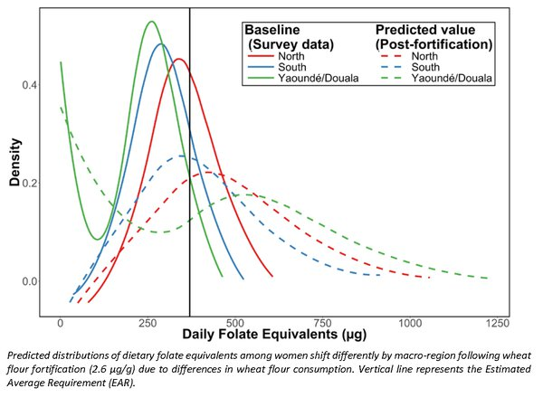

# Cameroon Models

As summarized in the figure above, to provide input into the planning and more efficient management of micronutrient intervention programs in Cameroon, the MINIMOD team has developed three sets of models. First, the nutrition benefits models use data on usual dietary intakes to provide spatially-explicit estimates of the number of individuals with low micronutrient intake and the predicted effect of candidate interventions, or combinations of them, on the number of individuals with low intake, or related outcomes. Second, cost models estimate, over time and over space, the total financial cost of delivering these interventions to target beneficiary groups. Finally, an economic optimization model combines the predicted benefits and estimated costs of all possible interventions (and combinations thereof) to determine the most cost-effective set of interventions, over time and over space.

## Benefits Model

### Description

The MINIMOD team has developed a set of modeling methods (the “nutrition benefits models”) to predict the impact of alternative micronutrient intervention programs, and combinations of programs. The methods take into account estimates of nutrient deficiency and inadequate nutrient intake and use information on dietary patterns and program reach to predict the effect of micronutrient programs on dietary adequacy and related outcomes. Through collaboration with the Lives Saved Tool, predicted impacts on lives saved and anemia cases averted are also generated.

### Data

The nutrition benefits models use dietary intake data that were collected using the 24-hour dietary recall method during a national survey of micronutrient status and dietary intake among children 12 to 59 months and women 15 to 49 years in Cameroon in 2009. The 24-hour recall interview process was repeated on a nonconsecutive day in a ~10% subset of households.

### Estimation Methods

Details of the dietary modeling methods are available [here](https://www.ncbi.nlm.nih.gov/pubmed/25332482) and [here](http://journals.sagepub.com/doi/abs/10.1177/0379572115595888).

We use the [National Cancer Institute method](http://riskfactor.cancer.gov/diet/usualintakes) to generate distributions of usual (habitual) nutrient intake.

The modeling process includes reviewing, and in some cases [developing](http://www.fasebj.org/content/30/1_Supplement/891.3.short), methods to estimate the bioavailability of micronutrients.

## Cost Model

### Description

Spreadsheet-based models were developed to estimate the costs of alternative micronutrient intervention programs, and combinations of interventions, over a 10-year planning time horizon. Where budgets from existing programs were available, these were used to estimate costs. In some cases, existing budgets were adjusted or adapted to isolate certain interventions or to estimate the costs of similar interventions. When actual budgets were not available, costs were constructed using known unit costs of program components combined with expert knowledge. Total costs for all interventions and combinations of interventions include planning, establishment, operational, and monitoring and evaluation costs.

### Costed Programs

- Vitamin A supplementation via child health days
- Deworming tablets via child health days
- Multiple micronutrient powders via child health days
- Vitamin A supplementation/deworming/micronutrient powder via health clinics
- Vitamin A supplementation/deworming/micronutrient powder via community-based programs
- Fortified wheat flour, edible oils, bouillon cubes
- Biofortified maize

## Optimization Model

### Description

The economic optimization model establishes a spatially explicit, intertemporal framework that takes as inputs the nutrition benefits of alternative micronutrient interventions and costs associated with planning and undertaking alternative interventions. Using mixed-integer linear programming, this information is combined to find economically efficient micronutrient intervention programs. The model can identify the intervention, or set of interventions, that most cost-effectively meet specific micronutrient objectives, e.g., effectively covering the same number of children as the set of micronutrient intervention programs current in place. The model can also be used to identify the maximum achievable impact (e.g., greatest number of child lives saved) given funding or other constraints.

Theoretically, the usefulness of the economic optimization model inherently depends on variation over space, time, and across target beneficiary groups in expected costs and benefits associated with alternative interventions. Even in a spatially homogenous country, predicting the benefits and costs of alternative program or policy scenarios can generate new insights that are useful for the planning process. Practically, the optimization model’s usefulness depends on the extent to which policy-makers use the information generated by the model process and can develop and implement programs that vary over space, time, and across target beneficiary groups, in ways suggested by the model.

### Pathways Analysis

Two other great concerns of decision-makers in Cameroon are: 1) the speed with which policy changes can practically be implemented; and 2) the evidence base that is required before ‘turning off’ major programs, especially those known to protect children at risk of micronutrient-related mortality. To address this issue in the context of vitamin A deficiency in young children, we used the economic optimization tool to construct alternative policy pathways leading from business-as-usual to more cost-effective sets of policies for addressing vitamin A deficiency. The results suggest, as expected, that the prudent policy pathways are macro-region-specific. These and other policy pathway analyses have greatly enhance the uptake of core MINIMOD messages in Cameroon and internationally and greatly enriched policy discussions in both arenas.
