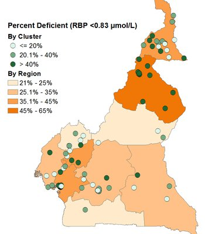
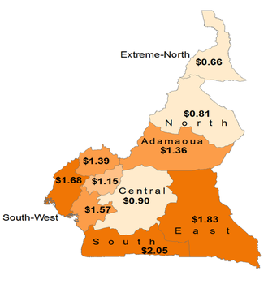
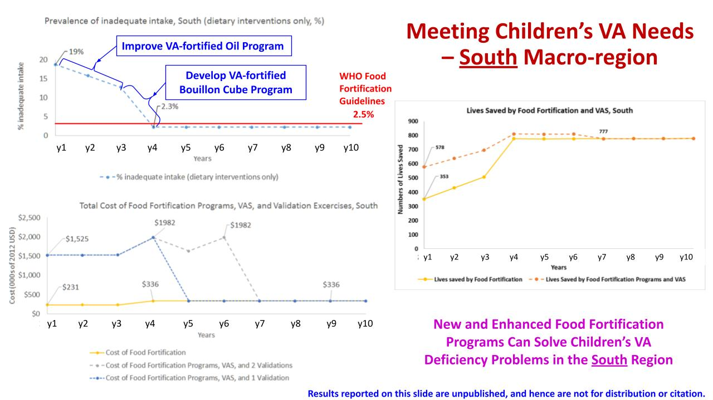
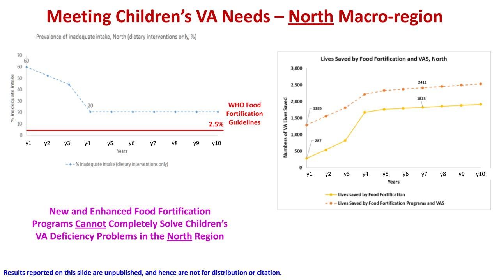

---
hide:
    - toc
---

# Micronutrient Policy Issues

## Micronutrient Deficiencies in Developing Countries

{align=left}

Micronutrients are key to promoting and sustaining life and development, and the prevalence of micronutrient deficiencies in developing countries is widespread. [@bailey2015epidemiology] Prevalence rates for some micronutrients can vary spatially, suggesting that in some cases, subnational intervention programs may be the most effective, and cost-effective.  The map below depicts vitamin A deficiencies among young children in Cameroon, by region.

Several micronutrients have been identified by the international community as especially critical, in part because of their effects on the growth and development of young children. For example, the World Health Assembly has set a 50% reduction, by 2025, in anemia among women of reproductive age as one of its [Global Nutrition Targets](http://www.who.int/nutrition/global-target-2025/en/). A second target is a 40% reduction in the number of children under 5 years of age who are stunted – addressing micronutrient deficiencies may have an important role to play in achieving this target in some populations.

## Consequence of Unmet Needs

The effects of micronutrient deficiencies can be substantial, long-lasting, and have large economic consequences.[@christian2015nutrition] [@hoddinott2013adult] For example, reducing iron deficiencies in Haiti by fortifying wheat flour over a 12-year period is estimated to have a cost-benefit ratio of approximately 24 [@engle2017preventative], suggesting the returns to investing in wheat flour fortification far outweigh the costs.

## Policy Objectives Associated with Needs

Once an agreed-upon set of micronutrient deficiencies has been established for policy action, the next critical step is to identify the measure, or measures, of impact that will be monitored and used to assess the success of selected intervention programs. Candidate measures of success include: [@engle2015estimating]

- Reach: the number (or %) of the target population (deficient or not) that consume more of a given micronutrient.
- Coverage: the number (or %) of the target population that is deficient and that consume more of a given micronutrient. 
- Effective coverage: the number (or %) of the target population that is deficient and that consume a sufficient additional amount of a given micronutrient to reach sufficient status.
- Minimum adequate intake: the number (or %) of the target population (deficient or not) that consume at least a specific additional amount of a given micronutrient (regardless of whether or not sufficient status is achieved).
- Lives saved: the number (or %) of the target population whose lives are saved due to increased consumption of a given micronutrient.[@engle2017estimating]

## Policy Instruments for Meeting Needs

There are many, often competing, ways of addressing micronutrient deficiencies; the expected impacts (however measured) and costs of these alternative intervention programs generally vary over space and time. Some examples of intervention programs include:

- [Large-scale fortification](http://www.ffinetwork.org/) of staple foods and condiments
- [Biofortification](http://www.harvestplus.org/) of staple crops
- Distribution of [high-dose vitamin A capsules](http://www.who.int/elena/titles/guidance_summaries/vitamina_children/en/) to young children
- [Social and behavior change communication](https://www.spring-nutrition.org/publications/briefs/sbcc-pathways-improved-maternal-infant-and-young-child-nutrition-practices) to promote breastfeeding
- Promotion of the [production and consumption of micronutrient-rich foods](http://www.hki.org/our-work/nourishing-families)

## The Costs of Micronutrient Intervention Programs

Nothing is free. All micronutrient intervention programs require upfront investments during the establishment phase, and funds to cover operational cost and monitoring and evaluation expenses. As with intervention program benefits, program costs can also vary over space and time. For example, regarding spatial variation, the map at right reports the region-specific costs of two Child Health Day campaigns in Cameroon, during which high-dose vitamin A capsules (and other products and services) were distributed.[@kagin2015measuring] 

## MINIMOD Approach to Choosing Cost-effective Sets of Micronutrient Intervention Programs

{align=right}

Finally, once decision-makers know the expected benefits and costs of all alternative combinations of national and sub-national micronutrient intervention programs, they must choose which ones to implement. However, choosing among potentially many hundreds of combinations of national and subnational program options can be very challenging, especially if some candidate interventions generate non-uniform benefits, or face non-uniform costs over space and time. 

The MINIMOD project solves this problem by developing an economic optimization model that ‘searches’ over all possible combinations of candidate interventions and, using cost-effectiveness as its decision criterion, chooses the most cost-effective set of programs for achieving an agreed-upon objective.  The cost savings associated with selecting more cost-effective intervention packages can be substantial.[@vosti2015economic]

## Using the MINIMOD Tool to Identifying Practical Policy Pathways

Transitioning from current micronutrient intervention programs to more efficient programs will never be quick or costless, but it still can be worthwhile.  The MINIMOD tool can help identify practical transition options for micronutrient intervention programs.8 (Cite the 2019 NYAS paper by Vosti et al., here) The figure below charts a path in the case of the Southern macro-region in Cameroon from a current set of programs (VAS via Child Health Days and a low-level VA-fortified edible oils program) to one that includes a VA-fortified bouillon cube (which takes several years to develop and promote) and an improved VA-fortified edible oils program (which takes two years to achieve).  Note that, in this macro-region, once these two programs are in place, inadequate intake of VA ceases to be a public health problem and the number of VA-preventable deaths shrinks to practically zero.  The programmatic savings (which can be repurposed to address other nutrition problems) can be substantial, and will depend on the number and timing of field-based confirmation exercises that are required. 

That said, it is not always the case that cost-effective nutrition policy changes can bring about reductions in spending on current programs. The figure below depicts the same investment scenario noted above, but this time in the North macro-region of Cameroon, where inadequate intake of VA is much more prevalent and severe. In this setting, the two new programs do reduce the prevalence of inadequate VA intake among children, but not to a level that permits the elimination of VAS distribution via Child Health Days. 

\bibliography