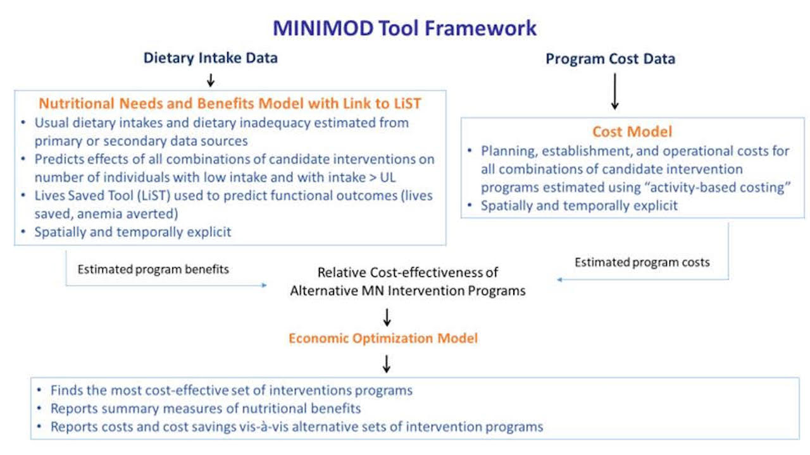

---
hide:
    - toc
---

The primary objective of the MINIMOD project is to provide input into the planning and more efficient management of micronutrient intervention programs in developing countries. To that end, the MINIMOD team uses a set of three interconnected models to identify the most cost-effective set of micronutrient intervention programs in a particular country, over space and time. The models can also help identify practical policy pathways moving from current sets of intervention programs to programs that are more efficient. These models, including supporting data and outputs, are depicted in the figure below.

First, the nutrition benefits models use data on usual or apparent dietary intakes to provide spatially explicit estimates of the numbers of individuals with low micronutrient intake, and the predicted effects of existing or alternative (hypothetical) interventions, or combinations of them, on the numbers of individuals with low intake, or related outcomes such as child deaths averted. Second, spatially and temporally explicit cost models estimate the total economic costs of designing, planning, launching, and managing micronutrient intervention programs.  Third, nutritional and health effects of programs are set alongside program costs to allow for ranking of programs in terms of cost-effectiveness.  Finally, an economic optimization model combines the estimated benefits and estimated costs of all existing and alternative (hypothetical) intervention programs (and combinations thereof) to determine the most cost-effective set of interventions, over time and over space.