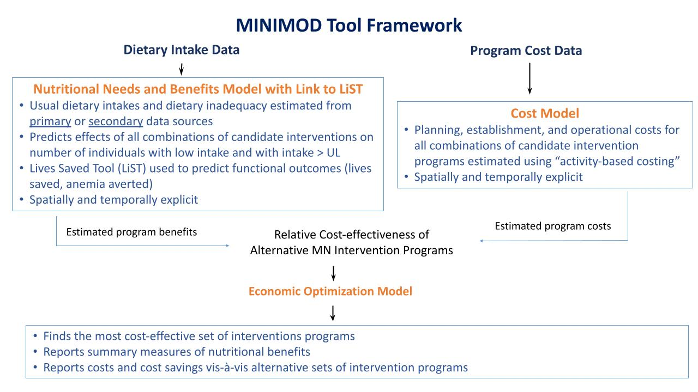

---
hide:
    - toc
---

The primary objective of the MINIMOD project is to provide input into the design and management of more efficient micronutrient intervention programs in developing countries. To that end, the MINIMOD team uses a set of three interconnected models to identify the most effective and cost-effective sets of micronutrient intervention programs in a particular country, over space and time. The models can also help identify practical policy pathways moving from current sets of intervention programs to programs that are more efficient. These models, including supporting data and outputs, are depicted in the figure below.

The nutritional needs/benefits model (upper left of the figure above), uses data on usual or apparent dietary intakes to provide spatially explicit estimates of the numbers of individuals with inadequate micronutrient intake, and the predicted effects of existing or alternative (hypothetical) intervention programs, or combinations of them, on the numbers of individuals with inadequate intake, or related outcomes such as child deaths averted. Estimated nutritional needs and intervention program benefits are spatially and temporally explicit, i.e., results can be generated at the national and subnational levels, at an annual timestep. The intervention program cost model provides estimates of the total economic costs of designing, planning, launching, and managing micronutrient intervention programs; cost estimates are also spatially and temporally explicit, and ‘match’ those of the nutritional needs/benefit model.  Results of the nutritional needs/benefits and cost models can be merged to provide evidence of the cost-effectiveness of alternative programs. Finally, an economic optimization model combines the estimated benefits and estimated costs of _all_** existing and alternative (hypothetical) intervention programs (and combinations thereof) to determine the most cost-effective set of interventions, over time and over space.